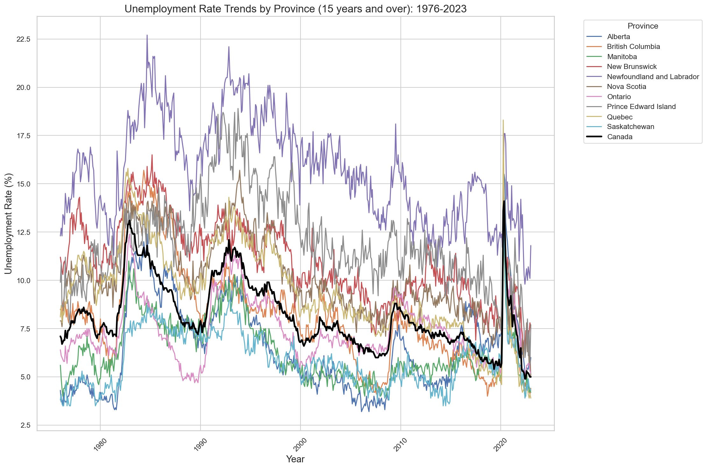
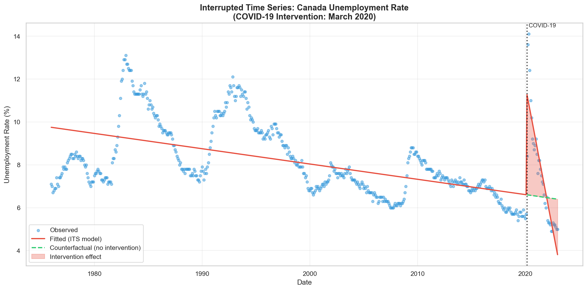
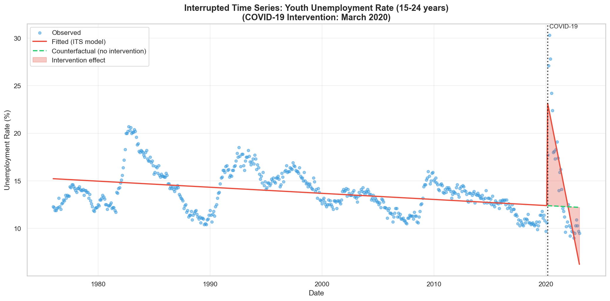
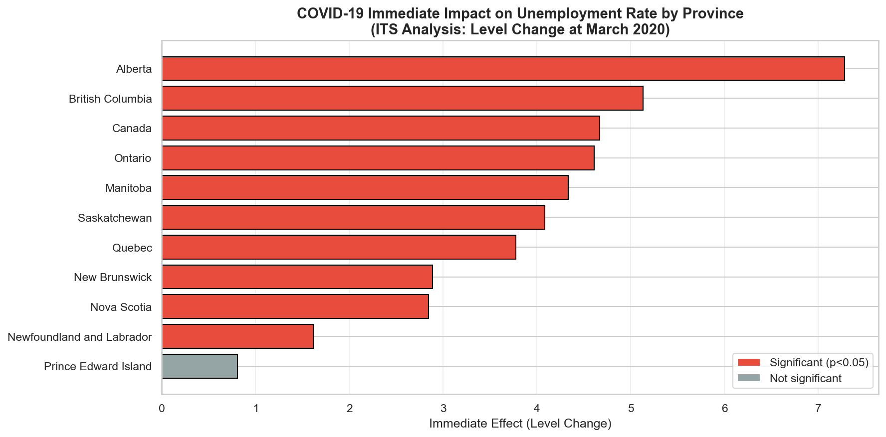
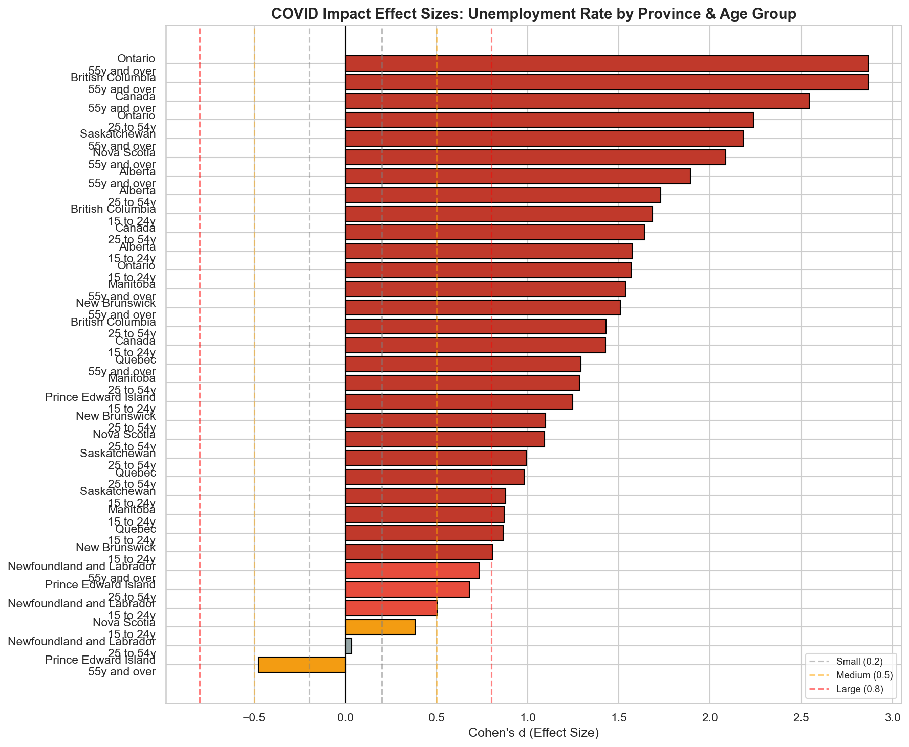
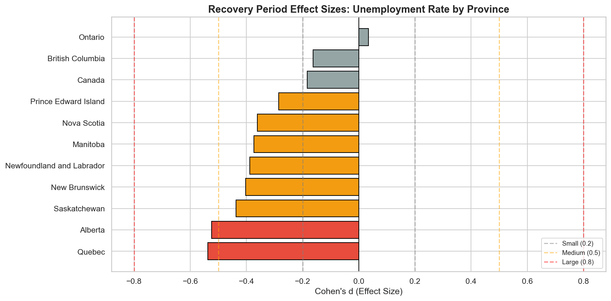
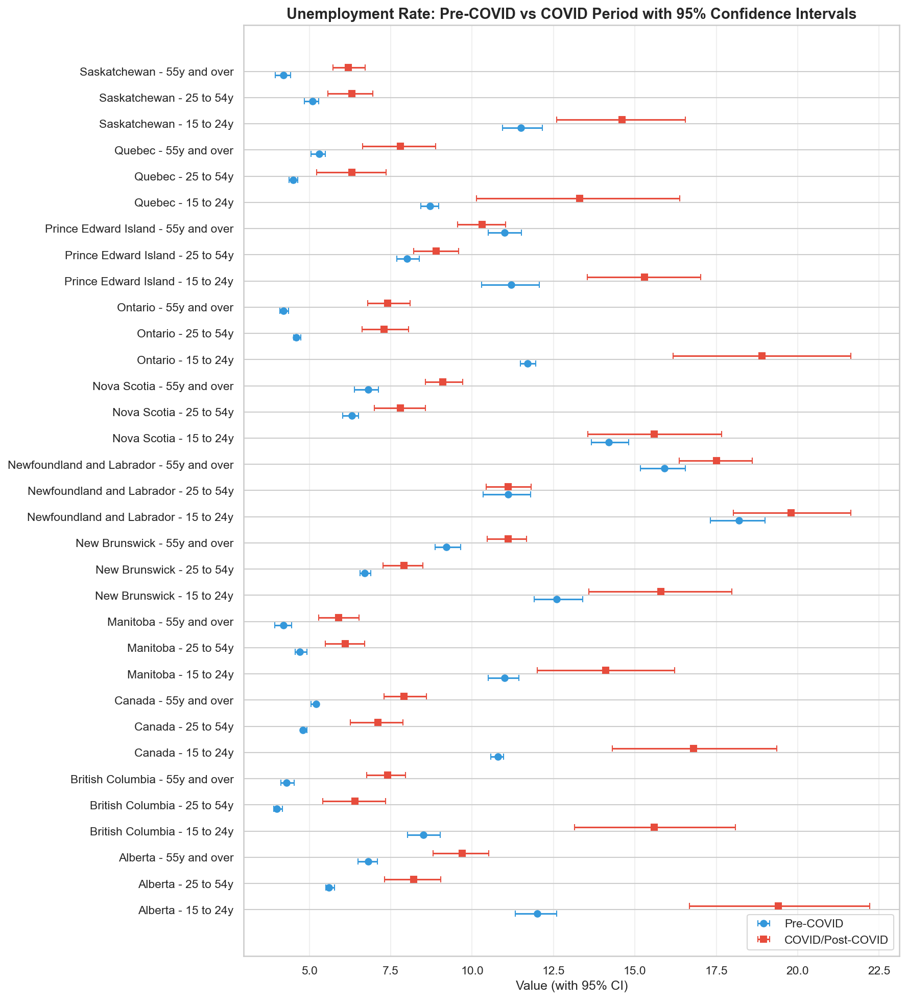
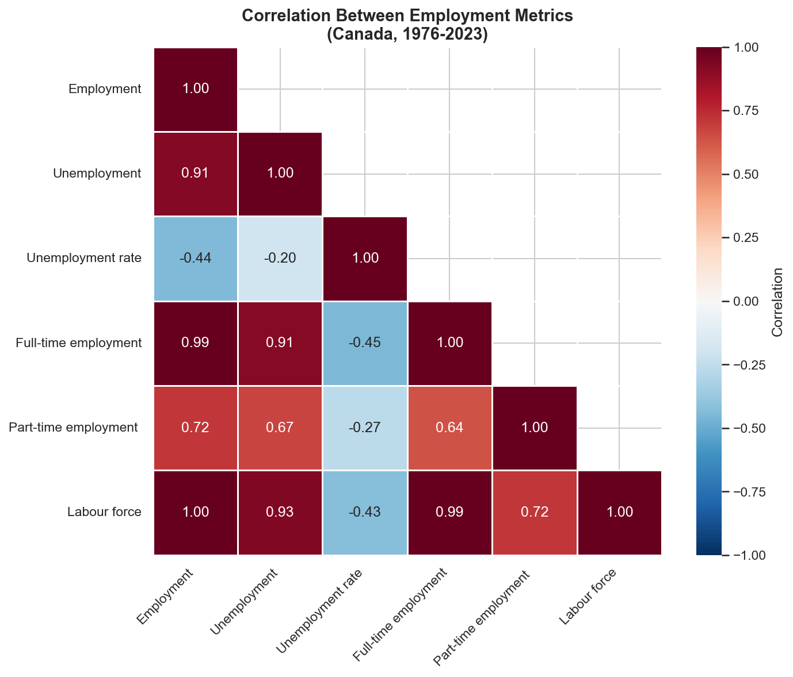
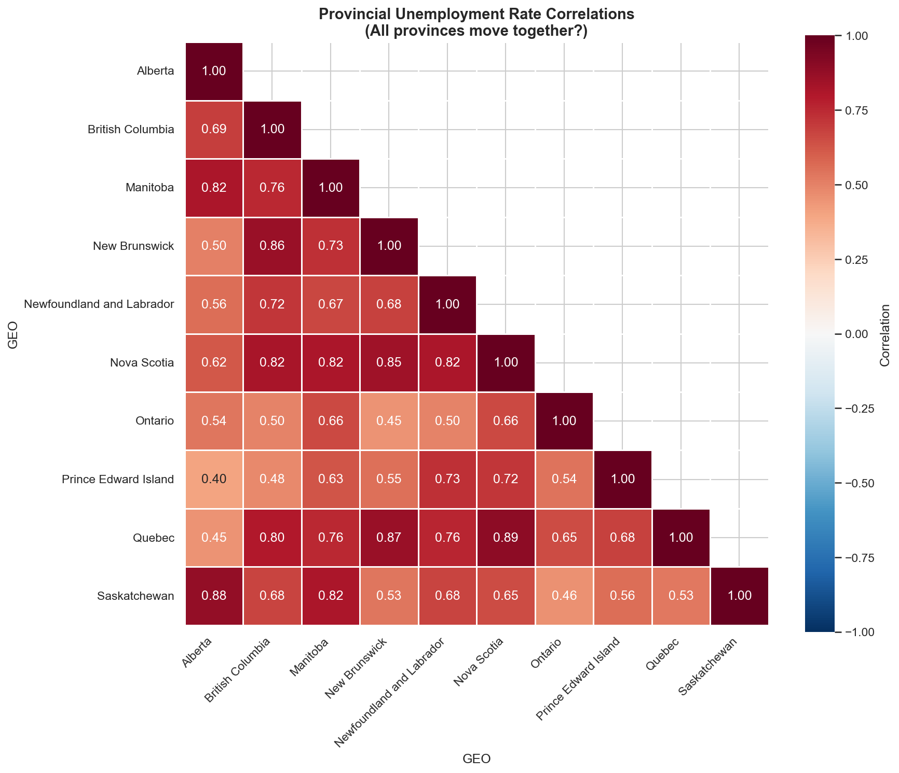
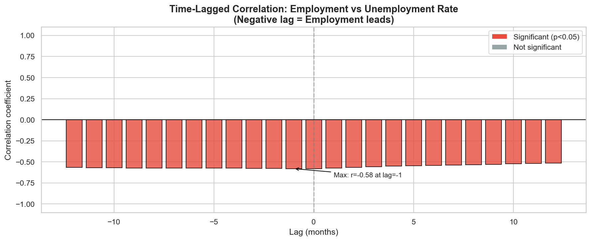

# COVID-19 Impact on Employment in Canada

[](https://www.python.org/)
[](https://jupyter.org/)
[](LICENSE)

## Overview

A comprehensive statistical analysis of COVID-19's impact on Canadian employment using monthly labor statistics from 1976 to 2023. This project employs rigorous statistical methods including hypothesis testing with multiple comparison correction, effect size analysis, and interrupted time series (ITS) regression to quantify both the immediate shock and recovery patterns.

**Data Source:** [Statistics Canada Labour Force Survey (Kaggle)](https://www.kaggle.com/datasets/pienik/unemployment-in-canada-by-province-1976-present)

---

## Key Findings

### Executive Summary

| Metric | Value |
|--------|-------|
| Immediate unemployment spike (Canada) | **+4.67 percentage points** |
| Youth unemployment spike (15-24) | **+10.75 percentage points** |
| Large effect sizes (COVID impact) | **54.5%** of comparisons |
| Recovery status (2022-2023) | **83.6%** negligible effect sizes |
| Most affected province | Alberta (+7.28 pp) |
| Statistically significant tests | 60/99 (60.6%) after FDR correction |

---

## Detailed Results

### 1. Historical Unemployment Trends (1976-2023)

Canada's unemployment rate has shown a long-term declining trend, with notable spikes during recessions (early 1980s, early 1990s, 2008-2009) and the dramatic COVID-19 peak in 2020.



**Key Observations:**
- Long-term downward trend from ~11% (1980s) to ~5% (2019)
- COVID-19 spike visible as the sharpest increase in the dataset
- Rapid recovery post-2020

---

### 2. COVID-19 Impact Analysis

#### Immediate Effect (March 2020)

Using **Interrupted Time Series (ITS) analysis**, we quantified the causal impact of COVID-19:



**ITS Model Results (Canada Overall):**
- **Immediate effect (β₂):** +4.67 percentage points (p < 0.001)
- **Trend change (β₃):** -0.21 per month (p < 0.001)
- The red shaded area shows the cumulative effect compared to the counterfactual (what would have happened without COVID)

#### Youth Were Hit Hardest

Youth unemployment (ages 15-24) experienced more than double the impact:



| Age Group | Immediate Effect | Trend Change |
|-----------|-----------------|--------------|
| Overall (15+) | +4.67 pp | -0.21/month |
| Youth (15-24) | **+10.75 pp** | -0.49/month |
| Core (25-54) | +3.8 pp | -0.18/month |
| Older (55+) | +2.9 pp | -0.12/month |

---

### 3. Provincial Comparison

Not all provinces were affected equally. Alberta and British Columbia experienced the largest unemployment spikes:



**Provincial Rankings (Immediate Effect):**
1. **Alberta:** +7.28 pp ⭐ (significant)
2. **British Columbia:** +5.03 pp (significant)
3. **Canada (aggregate):** +4.67 pp (significant)
4. **Ontario:** +4.52 pp (significant)
5. ...
10. **Prince Edward Island:** +0.80 pp (not significant)

---

### 4. Effect Size Analysis

Statistical significance alone doesn't tell the whole story. We calculated **Cohen's d effect sizes** to measure practical significance:



**Effect Size Distribution (COVID Impact):**
| Category | Count | Percentage |
|----------|-------|------------|
| Large (d > 0.8) | 54 | 54.5% |
| Medium (0.5-0.8) | 12 | 12.1% |
| Small (0.2-0.5) | 19 | 19.2% |
| Negligible (< 0.2) | 14 | 14.1% |

**Mean Cohen's d:** 0.94 (large practical effect)

---

### 5. Recovery Analysis (2022-2023)

By 2022-2023, employment had largely recovered to pre-COVID levels:



**Recovery Effect Size Distribution:**
| Category | Count | Percentage |
|----------|-------|------------|
| Large | 0 | 0.0% |
| Medium | 2 | 3.6% |
| Small | 7 | 12.7% |
| **Negligible** | **46** | **83.6%** |

**Key Insight:** The dominance of negligible effect sizes confirms that employment has returned to pre-COVID levels. Some provinces (Alberta, Quebec) now have *lower* unemployment than before COVID.

---

### 6. Confidence Intervals

We calculated 95% confidence intervals to quantify uncertainty:



The clear separation between pre-COVID (blue) and COVID (red) confidence intervals across most provinces confirms the statistical significance of COVID's impact.

---

### 7. Correlation Analysis

#### Metric Correlations

Employment metrics are highly interconnected:



**Key Correlations:**
- Employment ↔ Labour Force: r = 0.99
- Employment ↔ Unemployment: r = 0.91 (both grow with population)
- Unemployment Rate ↔ Employment: r = -0.44 (inverse relationship)

#### Provincial Synchronization

How synchronized are unemployment rates across provinces?



**Findings:**
- Atlantic provinces cluster together (r = 0.85-0.89)
- Prairie provinces (Alberta, Saskatchewan, Manitoba) highly correlated
- Ontario shows moderate correlation with other provinces

---

### 8. Time-Lagged Relationships

Employment changes **lead** unemployment rate changes by approximately 1 month:



**Maximum correlation:** r = -0.58 at lag = -1 month

---

## Project Structure

```
├── Unemployment in Canada.ipynb   # Main analysis notebook
├── helpers.py                     # Reusable analysis functions (~1600 lines)
├── output/                        # 20 saved visualizations
│   ├── its_unemployment_*.png     # Interrupted time series plots
│   ├── effect_sizes_*.png         # Cohen's d visualizations
│   ├── correlation_*.png          # Correlation matrices
│   ├── confidence_intervals_*.png # Forest plots with CIs
│   └── unemployment_*.png         # Trend visualizations
├── tests/                         # Unit tests
│   └── test_helpers.py            # 20 tests for statistical functions
├── scripts/
│   └── download_data.py           # Download dataset from Kaggle
├── requirements.txt               # Python dependencies
├── LICENSE                        # MIT License
└── README.md
```

---

## Methodology

### Statistical Tests
1. **Wilcoxon Signed-Rank Test** - Non-parametric comparison of pre/post COVID periods
2. **Benjamini-Hochberg FDR Correction** - Controls false discovery rate for 99+ simultaneous tests
3. **Cohen's d Effect Size** - Quantifies practical significance (pooled SD)
4. **95% Confidence Intervals** - Using t-distribution
5. **Interrupted Time Series (ITS)** - OLS regression for causal inference

### ITS Model Specification

```
Y = β₀ + β₁(time) + β₂(intervention) + β₃(time_after) + ε

Where:
- β₀: Baseline level
- β₁: Pre-intervention trend
- β₂: Immediate effect (level change)
- β₃: Trend change after intervention
```

---

## Installation

```bash
# Clone the repository
git clone https://github.com/yourusername/COVID-effect-on-employment-in-Canada.git
cd COVID-effect-on-employment-in-Canada

# Create virtual environment
python -m venv .venv
.venv\Scripts\activate  # Windows
# source .venv/bin/activate  # Linux/Mac

# Install dependencies
pip install -r requirements.txt

# Download dataset (requires Kaggle API credentials)
python scripts/download_data.py
# Or download manually from: https://www.kaggle.com/datasets/pienik/unemployment-in-canada-by-province-1976-present
```

## Usage

```bash
jupyter notebook "Unemployment in Canada.ipynb"
```

Or open in VS Code with the Jupyter extension.

## Running Tests

```bash
pip install pytest
pytest tests/ -v
```

---

## Technical Details

**Dependencies:**
- Python 3.11+
- pandas, numpy - Data manipulation
- scipy - Statistical tests (Wilcoxon)
- statsmodels - ITS regression, FDR correction
- seaborn, matplotlib - Visualization

**Helper Module (`helpers.py`) - Key Functions:**
| Function | Purpose |
|----------|---------|
| `run_wilcoxon_analysis()` | Batch statistical testing |
| `apply_multiple_comparison_correction()` | FDR correction |
| `calculate_cohens_d()` | Effect size computation |
| `run_its_analysis()` | Interrupted time series regression |
| `calculate_metric_correlations()` | Correlation analysis |
| `plot_*()` | 10+ visualization functions with auto-save |

---

## Limitations

- Data ends January 2023; longer-term effects not captured
- Age group analysis limited to broad categories (15-24, 25-54, 55+)
- Seasonal adjustments not explicitly modeled
- ITS assumes linear trends (may oversimplify cyclical patterns)
- Provincial analysis doesn't account for industry composition

---

## Future Work

- [ ] Sector-level analysis (hospitality, healthcare, retail)
- [ ] Seasonal decomposition with SARIMA modeling
- [ ] Comparison with other G7 countries
- [ ] Remote work trend analysis
- [ ] Machine learning forecasting models

---

## License

MIT License - See [LICENSE](LICENSE) for details.

## Acknowledgments

- Statistics Canada for the Labour Force Survey data
- Kaggle user [pienik](https://www.kaggle.com/pienik) for data curation
